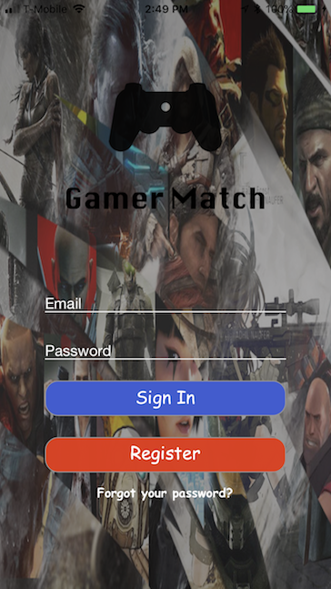
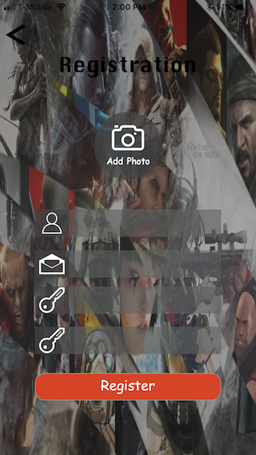
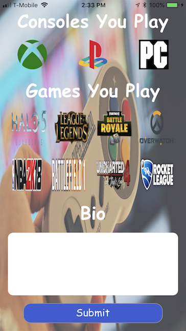
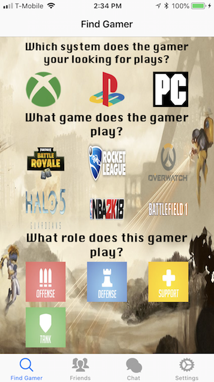
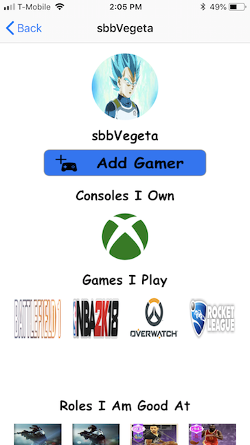
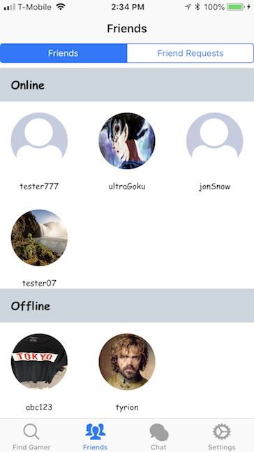
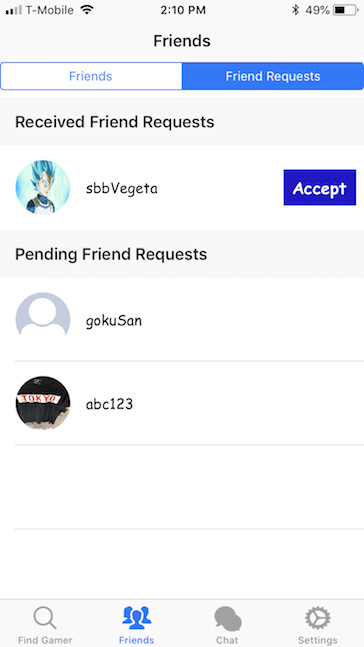
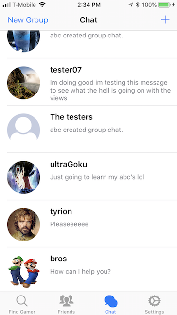
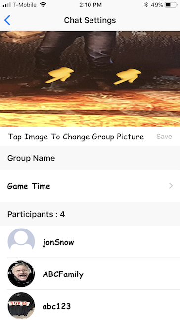
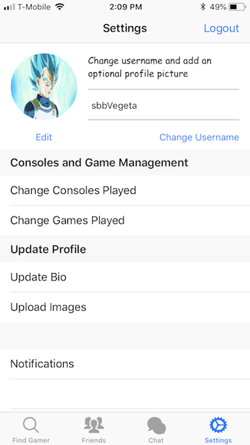

# GamerMatch

This is a social media app which helps connect gamers with other gamers who play
the same team based video games. 

For desigining prototype UI screens before creating them on Xcode, Sketch was used.
To save registered user's data, Google Firebase was used.

The main screen when the app is initially opened.

First part of the registration, asks for usual information such as username, email and
password. The user can also upload an image for the profile through the camara
or their photo library.

Second part of the registration, the gamer is asked to select the consoles he/she plays
and the games they play. If the game is available for multiple consoles they must specify
the consoles they play on for the selected game.

A registered user can search for gamers by specifying the type of gamer they
want to connect to.

Once the user looks through the results from the search they can click on a gamer
and view their profile and send them a friend request.

A user can view their friends list and see who is online or offline.

Also they can check if they got new friend requests and any pending requests
they have sent.

The app supports group chats and 1 on 1 private chats

Members from the group chat can change the chat avatar image or the title and
view all the members in the group.

User can change their username or profile picture. In addition they can change 
the consoles they played, their bio and images they can display when viewers 
view their profile.

